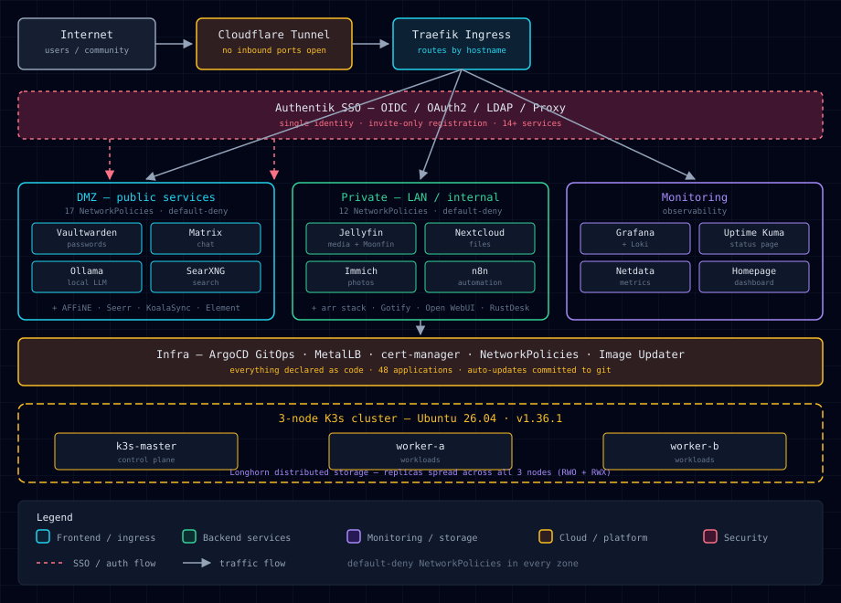

# MySweetPea Homelab — Kubernetes GitOps

[](https://k3s.io)
[](https://argo-cd.readthedocs.io/)
[](https://k3s.io)
[](https://mysweetpea.cc)
[](https://goauthentik.io)
[](https://longhorn.io)
[](LICENSE)

A self-hosted, GitOps-managed Kubernetes cluster running **40+ services** for
the MySweetPea community — privacy-first alternatives to everyday cloud
services, all running on hardware I own and manage.

**Live site:** https://mysweetpea.cc
**Website repo:** https://github.com/mysweetpea/portfolio

---

## Architecture



### At a glance

- **3-node K3s cluster** (v1.36.1+k3s1, Ubuntu 26.04) — one control-plane node
  and two workers
- **Flannel** CNI, **Traefik** ingress, **MetalLB** load balancer (21-IP pool)
- **Longhorn** distributed storage (RWO + RWX) across all three nodes
- **Cloudflare Tunnel** for external access — **no inbound ports open**
- **ArgoCD** GitOps with **Image Updater** — container images auto-update and
  version bumps are committed back to this repo (48 applications)
- **Authentik** SSO (OIDC + LDAP + Proxy outposts) — single sign-on across
  14+ public-facing services
- **Netbird** mesh VPN for private LAN access, with a cloud VPS acting as relay
- **3-zone VLAN** segmentation (OpenWrt firewall) plus **29 Kubernetes
  NetworkPolicies** enforcing default-deny ingress (17 in the DMZ, 12 in the
  private zone)

---

## What is this?

MySweetPea is a collection of self-hosted services — password manager, media
server, cloud storage, notes, AI chat, private search, and more — provided to a
small community. Instead of renting servers from a cloud provider, everything
runs on a **3-node Kubernetes cluster** in a home lab.

This repository is the **single source of truth** for that infrastructure.
Every service, configuration, and security policy is declared as code here.
Nothing is configured by hand on the servers — if it isn't in this repo, it
doesn't exist.

---

## Why GitOps?

All infrastructure changes flow through Git, which gives three things that
matter for any production system:

1. **Reviewability** — every change is a commit with a message; nothing happens
   silently.
2. **Auditability** — the full history of the infrastructure is preserved,
   including who changed what and when.
3. **Recovery** — if a node dies or a cluster needs rebuilding, the entire
   stack can be recreated from this repo.

[ArgoCD](https://argo-cd.readthedocs.io/) continuously compares the live
cluster against this repo and reconciles any drift — if someone changes a
deployment by hand, ArgoCD puts it back to the declared state.

---

## How it works

### GitOps loop

The root application (`bootstrap/root-application.yaml`) discovers every child
`application.yaml` under `apps/`:

```yaml
directory:
  recurse: true
  include: "**/application.yaml"
```

Each service directory follows the same pattern:

- `application.yaml` — the ArgoCD Application (Helm chart + values reference +
  Image Updater annotations)
- `values.yaml` — the Helm values (bjw-s `app-template` chart)

**Safety settings** — added after two data-loss incidents early on:

```yaml
syncPolicy:
  automated:
    prune: false      # NEVER auto-prune — prevents namespace/PVC deletion
    selfHeal: false   # requires manual sync for structural changes
```

The `private`, `dmz`, and `monitoring` namespaces carry
`helm.sh/resource-policy: keep` so they survive syncs.

> ⚠️ **Lesson learned:** ArgoCD syncs from the **committed** Git state, not the
> working tree. Uncommitted `values.yaml` changes are silently ignored — always
> commit and push before syncing.

### Secrets management

Credentials are the hardest part of any GitOps setup — you can't commit
plaintext passwords to a public repo, but you also can't lose them.

The solution is **Sealed Secrets**: secrets are encrypted with the cluster's
public key and committed as `SealedSecret` resources (28 of them, under
`sealed-secrets/`). Only the cluster's private key — which never leaves the
cluster — can decrypt them. ArgoCD applies them like any other manifest, and a
cluster rebuild only needs the sealed-secrets key (which is captured in the
backups).

```bash
kubeseal --format yaml < secret.yaml > sealed-secrets/<ns>/<name>.yaml
```

### Network security

Security is layered, defense-in-depth:

1. **Physical segmentation** — the network is split into 3 VLAN zones at the
   router (OpenWrt firewall), isolating management, DMZ, and private traffic.
2. **Default-deny at the cluster level** — 29 Kubernetes NetworkPolicies
   enforce zero-trust: nothing can talk to anything unless a policy explicitly
   allows it. The DMZ has 17 policies, the private zone 12.
3. **No exposed ports** — all public access goes through a Cloudflare Tunnel;
   there are no inbound firewall rules to attack.
4. **Single identity** — Authentik provides SSO (OIDC/OAuth2) with invite-only
   registration, so users have one account and services never manage their own
   password databases.

### Automated updates

ArgoCD Image Updater watches annotated images, checks registries for new
versions, and commits version bumps back to this repo (git write-back). The
cluster has processed 100+ automatic update commits — services stay current
without manual intervention.

---

## What runs on it

| Zone | Services |
|------|----------|
| **DMZ** (public, behind SSO) | Authentik, Cloudflare Tunnel, Matrix (Synapse + Element), Vaultwarden, AFFiNE, Seerr, KoalaSync, Ollama, SearXNG |
| **Private** (LAN / internal) | Jellyfin (Moonfin + 34 plugins), Nextcloud, Immich, n8n, Gotify, Open WebUI, Radarr/Sonarr/Bazarr/Prowlarr/qBittorrent, AIOStreams, RustDesk, MCP server, NZBDav, OpenClaw, Flaresolverr, PostgreSQL, Redis |
| **Monitoring** | Homepage dashboard, Uptime Kuma, Grafana + Loki + Promtail, Netdata |
| **Infra** | ArgoCD, Image Updater, cert-manager, Longhorn, MetalLB, NetworkPolicies |

### Media streaming (on-demand, Netflix-style)

The media stack is a **Stremio-like on-demand streaming platform**, not a
traditional download library:

- **Gelato** (Jellyfin plugin) imports catalog metadata from **AIOStreams**
  (a Stremio addon aggregator) into the Jellyfin database — ~400 movies,
  175 series, 15k episodes of *virtual* items, refreshed daily via a
  scheduled import that dedupes by IMDB id.
- **Streams resolve on demand**: AIOStreams queries Zilean/Comet/Jackettio
  etc., then Real-Debrid serves the actual file over HTTPS. Stream results
  are cached 24h (StreamTTL) so browsing stays instant after first touch.
- **Zero local storage** for media — the 200Gi PVC is reserved for future
  local libraries; everything streams through the debrid proxy.
- Full premium UI: Moonfin web frontend (custom nordic theme), Home Screen
  Sections rows, Media Bar hero carousel, quality tags, intro skipping.
- **Self-healing**: a cron watcher (5-min) verifies the AIOStreams manifest
  URL in Gelato's config and auto-repairs it after config re-imports,
  alerting via Gotify if manual action is needed.

---

## Backups

Automated backups run daily on the control-plane node:

| What | When | Details |
|------|------|---------|
| PostgreSQL dumps | daily 02:00 | All databases, 4-day retention |
| K8s config snapshots | daily 03:00 | Cluster state, 7-day retention |
| restic (encrypted) | daily 02:30 | Off-site to two locations (cloud VPS + local PC), retention 7 daily / 4 weekly / 6 monthly + prune |

The restic job also captures the **sealed-secrets key** (critical for cluster
rebuild) and gzip-compresses the k3s state database before upload (127 MB →
~11 MB). Restic's content-defined chunking deduplicates similar dumps, keeping
the off-site repos small.

---

## Repository layout

```
├── bootstrap/
│   └── root-application.yaml   # Root ArgoCD app (app-of-apps, prune:false)
├── apps/
│   ├── dmz/                    # Internet-facing services (behind tunnel/SSO)
│   │   ├── authentik/          # SSO provider (OIDC/LDAP/Proxy)
│   │   ├── authentik-ldap-outpost/
│   │   ├── authentik-tls-proxy/
│   │   ├── cloudflared/        # Cloudflare Tunnel
│   │   ├── element-web/        # Matrix client
│   │   ├── matrix-synapse/     # Matrix homeserver
│   │   ├── vaultwarden/        # Password manager
│   │   ├── affine/             # Notes
│   │   ├── seerr/              # Media requests
│   │   ├── koalasync/          # Sync
│   │   ├── ollama/             # Local LLM
│   │   ├── searxng/            # Private search
│   │   └── ingress-routes/     # Traefik IngressRoutes + Auth middleware
│   ├── private/                # LAN / internal services
│   │   ├── jellyfin/           # Media server (Moonfin + 34 plugins)
│   │   ├── postgresql/         # Shared PostgreSQL (PG18)
│   │   ├── n8n/                # Automation + webhook backend
│   │   ├── nextcloud/          # Files
│   │   ├── immich/ + immich-postgresql/  # Photos
│   │   ├── gotify/             # Notifications
│   │   ├── open-webui/         # AI chat
│   │   ├── radarr/ sonarr/ bazarr/ prowlarr/ qbittorrent/  # Media stack
│   │   ├── aiostreams/         # Streaming (Stremio-style)
│   │   ├── rustdesk/           # Remote desktop
│   │   ├── flaresolverr/       # Cloudflare-bypass proxy
│   │   ├── nzbdav/ openclaw/ mcp-server/
│   │   ├── media-storage/      # Shared 200Gi media PVC
│   │   ├── redis-affine-master/
│   │   └── ingress-routes/
│   ├── monitoring/
│   │   ├── homepage/           # Dashboard
│   │   ├── uptime-kuma/        # Status page (status.mysweetpea.cc)
│   │   ├── grafana/ + loki/ + promtail/ + netdata/   # Observability
│   │   └── ingress-routes/
│   └── infra/
│       ├── argocd/             # ArgoCD config
│       ├── argocd-image-updater/
│       ├── cert-manager/
│       ├── longhorn/
│       ├── metallb/
│       ├── network-policies/   # 29 NetworkPolicies (17 dmz + 12 private)
│       ├── coredns-custom.yaml
│       ├── traefik-dashboard.yaml
│       └── argocd-sync-windows.yaml
└── sealed-secrets/             # Encrypted secrets (28 files)
    ├── argocd/
    ├── dmz/
    └── private/
```

---

## Common operations

### Sync an app

```bash
argocd login <argocd-server> --username admin --password <pass> --insecure
argocd app sync <app-name>
```

### Add a new service

1. Create `apps/<ns>/<service>/application.yaml` + `values.yaml`
2. Commit + push
3. `kubectl apply -f apps/<ns>/<service>/application.yaml`
4. `argocd app sync <service>`

### Check auto-update status

```bash
argocd-image-updater list
```

---

## License / contact

Questions: support@mysweetpea.cc
Website: https://github.com/mysweetpea/portfolio
This repo: https://github.com/mysweetpea/homelab-k8s
